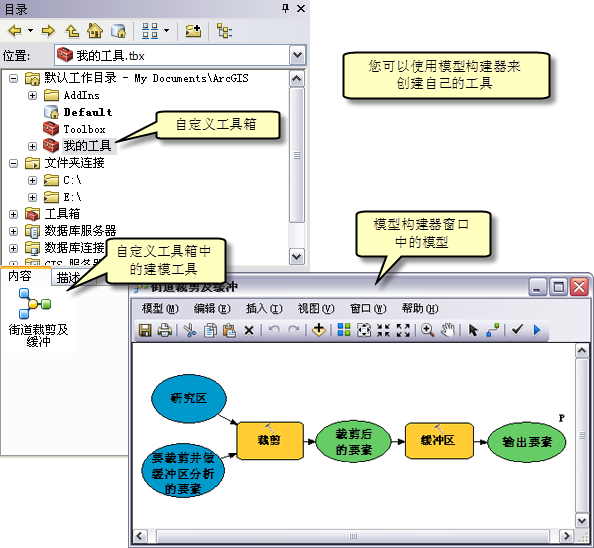

# ArcGIS Desktop －－AcrMap简介

ArcGIS Desktop 是 ArcGIS 的基础。旗下现有ArcMap和ArcGIS Pro两大系列，因为一直以来大家都是使用的ArcMap系列，因此，以它为主要学习对象。参考官方网站[ArcMap](http://desktop.arcgis.com/zh-cn/arcmap/).

使用 **ArcMap**、**ArcCatalog**、**ArcGlobe** 和 **ArcScene**（传统 ArcGIS Desktop 应用程序）创建地图、执行空间分析、管理地理数据和共享结果。

ArcGIS Desktop也是收费的，如果学校有正版直接使用学校的最好，没有的话也可以先试用，然后购买学生版本，100刀一年。

对于ArcGIS的学习，[Learn ArcGIS网站](https://learn.arcgis.com/zh-cn/)提供了学习ArcGIS平台基础知识的课程和工程，可以参考，[课程库页面](https://learn.arcgis.com/zh-cn/gallery/)提供了大量素材可以参考，不过ArcMap的内容相对较少，好在几个案例还是通过实例分析比较好地介绍了ArcGIS的功能，但是个人觉得还是通过ArcMap网页的内容学习较直接。

首先看看整体基本内容有什么。根据ArcMap网站的介绍，主要包括以下内容：

- 创建地图：在 **2D 和 3D** 环境中**可视化、解释、比较和汇总空间数据**。设计用于打印或在线发布的地图布局。
- 执行分析：了解**空间关系**、查找**位置和路径**、检测**模式**并进行**预测**。使用地理处理工具执行分析。
- 管理地理数据：**创建**、**管理**和**编辑地理信息**，其中包括**要素、表格、影像、激光雷达和其他类型的数据**。
- 自动化工作流：使用**地理处理模型**和**脚本**来**自动化**、改进和共享您的**工作流**。
- 扩展Desktop：**添加功能**以执行高级分析、优化数据和任务管理，并支持特定于行业的工作流。
- 自定义桌面：根据需要**配置用户界**面。为您的组织**开发自定义工具、菜单、加载项和扩展模块**。

接下来整合下上述相关内容，记录用的到的主要内容。

## 地图

使用ArcGIS做空间数据分析第一步自然就是导入数据了，地图毫无疑问就是认识ArcGIS的第一步，这部分内容都参考自官网导航栏下的[“地图”模块](http://desktop.arcgis.com/zh-cn/arcmap/10.5/map/main/what-is-arcmap-.htm)。这里我使用的是ArcGIS 10.5，因此接下来都是参考的该版本下的文档。

### ArcMap一览

在 ArcMap 中，可以**显示和浏览**研究区域的 **GIS 数据集**，可以指定符号，还可以创建用于打印或发布的地图布局。ArcMap 也是用于**创建和编辑数据集**的应用程序。ArcMap 文档，也称为地图文档或 mxd，保存的文件格式就是mxd。

#### ArcMap 视图

ArcMap 将地理信息表示为**地图中的图层和其他元素的集合**。常见的地图元素包括**含有给定范围的地图图层的数据框**，以及**比例尺、指北针、标题、描述性文本和符号图例**等等。ArcMap 中有两种主要的地图视图：数据视图和布局视图，平时主要使用前者，最后出图会用到后者。

- 数据框属于一种地理窗口或地图框，可在其中将地理信息作为一系列地图图层进行显示和处理。
- 布局视图是一种页面视图，可在页面中对地图元素进行排列（例如数据框、比例尺和地图标题）以便打印地图。

在数据框内部，地理数据集以**图层形式**显示，而每个图层都表示在地图中叠加的特定数据集。地图图层可通过以下方式传达信息：

- 离散要素类，例如点集合、线集合和面集合
- 连续表面（例如高程）可采用多种方式表示这些表面，例如，作为等值线集合和高程点，或者作为地貌晕渲
- 包含地图范围的航空影像或卫星影像

图层**不会存储实际的地理数据**。而是需要**引用数据集**，例如要素类、图像以及格网等。以此方式引用数据可使地图中的图层自动**呈现 *GIS 数据库*中的最新信息**

#### ArcMap 目录

ArcMap、ArcGlobe 和 ArcScene 中都设有目录窗口（ArcMap中在界面右侧），通过该窗口可将各种类型的地理信息（例如，在 ArcGIS 中使用的当前 GIS 项目的数据、地图和结果）作为逻辑集合进行组织和管理。

ArcMap 中的主要工作空间之一就是各地图文档的主目录文件夹，即home文件夹，即存储地图文档的文件夹位置。在 ArcMap 中，主目录文件夹在默认的情况下可用于保存结果、存储新建数据集以及访问基于文件的信息。

每个地图文档都有一个默认地理数据库，作为**地图空间内容的本地位置**。此位置可用于添加数据集和保存各种编辑操作和地理处理操作生成的结果数据集。例如，从图层中导出要素时，除非另外指定，否则**数据会自动保存到地图的默认地理数据库**中。默认地理数据库与“地理处理环境”的“当前工作空间”始终一致，因此工具或模型的所有输出内容都将保存到此默认位置。

创建新地图文档时，系统将提示您选择默认地理数据库。不必为文档手动指定默认地理数据库。默认情况下，ArcGIS 将会在 ArcGIS 默认工作目录文件夹（一般是在C盘下面用户文件夹下的文档文件夹内的ArcGIS文件夹里）**自动创建一个名为 Default.gdb 的文件地理数据库**。通过“目录”窗口下的图标可以访问默认地理数据库快捷方式。

#### ArcMap 主要功能

ArcMap 是 ArcGIS 中使用的主要应用程序，可用于执行各种常见的 GIS 任务以及专业性的用户特定的任务，主要如下（个人觉得常用的加粗）：

- **处理地图**：浏览信息、地图文档，打开或关闭图层，查询要素以访问地图背后大量的属性数据，以及可视化地理信息；
- 打印地图：打印地图（从最简单的制图到复杂制图）；
- **编译和编辑 GIS 数据集**：处理地理数据库数据集。支持可扩展的全功能编辑。可选择地图文档中的图层进行编辑，而新增要素和更新的要素将保存在图层的数据集中。
- **使用*地理处理*来自动完成工作及执行任务**：可执行任意地理处理模型或脚本，还可以通过地图可视化来查看及处理结果。地理处理可用于分析，也可以自动执行许多普通任务。
- **组织和管理地理数据库和 ArcGIS 文档**：ArcMap 具有目录窗口，可用于组织所有 GIS 数据集和地理数据库、地图文档和其他 ArcGIS 文件、地理处理工具及许多其他 GIS 信息集。也可以在目录 窗口中设置和管理地理数据库方案。
- 使用 ArcGIS Server 将地图文档发布为地图服务：通过将地理信息发布为一系列地图服务，可以在 Web 上灵活展现 ArcGIS 内容。ArcMap 中的将地图文档发布为地图服务提供了简单的用户体验。
- 与其他用户共享地图、图层、地理处理模型和地理数据库：ArcMap 具有一些工具，便于用户对 GIS 数据集进行打包，以及与其他用户共享。这包括使用 ArcGIS Online 共享 GIS 地图和数据的功能。
- 记录地理信息：描述地理信息集以帮助您记录项目并实现更高效的搜索和数据共享是 GIS 社区的一个主要目标。可以使用目录窗口记录所有 GIS 内容。对于使用基于标准的元数据的组织，也可以使用 ArcGIS 元数据编辑器记录数据集。
- **自定义用户体验**：ArcMap 具有若干用于自定义的工具，可以编写软件加载项以添加新功能、简化用户界面以及使用地理处理实现任务自动化。

### 地图投影

使用ArcMap展示地图时，首先要清楚的就是投影。投影的基本概念可以参考本项目下的gis-knowledge.md文档，这里主要从ArcGIS角度认识下投影。主要参考[ArcGIS中的坐标系：基本概念和常用操作](http://blog.sciencenet.cn/blog-290812-1016263.html). 不再复述，就记录下核心观点，详细的版本还是参考原文。

- 投影是坐标系的属性；
- 坐标系是地图的属性，坐标系有两类：地理坐标系和投影坐标系；
- 地理坐标系由**角度单位，本初子午线和大地测量系统**定义，大地测量系统最重要的参数是**椭球**；
- 投影坐标系“WGS_1984_UTM_Zone_50N”这个名称中的“WGS_1984”指出了其地理坐标系为“GCS_WGS_1984”，而“UTM_Zone_50N”则指出了其投影;
- ArcGIS中有三个概念易混淆：**真实坐标系，属性坐标系，地图坐标系**：
    - 数据的真实坐标系是指数据记录本身所对应的坐标系，即一个位置，它在某个坐标系下是什么就是什么，只要是地图，必然有坐标，这就是真实坐标系；
    - 数据属性所标称的坐标系是指数据文件的属性所标称的坐标系，在数据的Layer Properties的“Source”标签中可以查看Coordinate System信息；数据的真实坐标系和属性坐标系不同时就出现错误，比如一个PointShapefile数据（116.679267°E，40.408265°N）的真实坐标系为地理坐标系GCS_WGS_1984，而将属性坐标系设置为投影坐标系WGS_1984_UTM_Zone_50N，图书馆点就会跑到赤道附近的印度尼西亚去，因为系统会认为此点在投影坐标系WGS_1984_UTM_Zone_50N中坐标值为（116.679267，40.408265），而在投影坐标系WGS_1984_UTM_Zone_50N中正确的坐标值应为（472786.066803，4473121.59882）。一般情况下数据都有属性坐标系，且与真实坐标系吻合，是不需要特别考虑的，所以一般统一称作**数据坐标系**。
    - ArcMap/ArcScene中Layers的坐标系是指当我们把若干矢量数据或栅格数据加载进ArcMap或ArcScene里面组成“Layers”的时候，这个Layers的坐标系。“地图坐标系”在ArcMap中可以通过右击“Layers”打开“Data Frame Properties”后在“Coordinate System”标签中查看或者修改。一个Layers可以包括多个数据Layer，这些数据Layer的坐标系也可以各不相同。当在ArcMap中加载多个数据Layer时，系统会自动将第一个加载进来的有坐标系的数据的坐标系作为Layers的地图坐标系。当某个Layer的数据坐标系与Layers的地图坐标系不同时，系统会自动用一定的算法将数据坐标系（的坐标值）临时转换为地图坐标系（的坐标值）。
    - 另外，最后还有个**地图显示单位**的概念，即右下角的一个坐标显示，可以在Layers的Properties中的“General”标签中进行设置。地图单位由地图坐标系决定，地图显示单位可以与地图单位相同，也可以与地图单位不同。

### 地图图层

在ArcMap中最常接触的就是图层了，图层是 ArcMap、ArcGlobe 和 ArcScene 中地理数据集的显示机制。每个图层都会引用存储在地理数据库、coverage、shapefile 和栅格等中的数据集。图层会**引用存储在地理数据库、coverage、shapefile、影像、栅格和 CAD 文件等数据源中的数据**，而不是真正地存储地理数据。

要创建新地图图层，只需将数据集添加到地图、globe 或 3D 场景中即可。

可针对各地图图层所引用的数据集使用**属性表**。右键单击内容列表中的某个图层，然后单击打开属性表。在表 窗口中，可执行查询、选择以及在地图上定位要素等操作。

即使数据存储在不同图层和表中，也同样需要经常识别相关数据以执行查询和编辑相关数据。ArcMap 提供了三种关联相关数据的方法：关联、连接以及空间连接。

- 关联：关联使用两个属性表的公共键来定义两表之间的关系。通过关联，可以在使用图层的属性时访问相关数据。关联与简单关系类相似，不同点在于关联可涉及不同工作空间的数据（例如，dBASE 表可与 coverage 关联）并且存储在图层文件或 ArcMap 文档中。
- 连接：当连接两个表时，可以基于两个表的公用字段将属性从一个表追加到另一个表上。连接主要用来基于关联数据对图层进行标注和符号化。
- 空间连接：地图上的图层未共享公用属性字段时，可以使用空间连接将其连接起来。空间连接将根据图层中要素的位置对两个图层的属性进行连接。空间连接与属性连接不同，它不是动态连接，而是需要将结果保存到新的输出图层中。

以下是几种常见图层类型：

- 要素图层：引用一组要素（矢量）数据的图层，其中这些数据表示点、线、面等地理实体。要素图层的数据源可以是地理数据库要素类、shapefile、ArcInfo Coverage 以及 CAD 文件等。
- 栅格图层：引用栅格或图像作为其数据源的图层。
- 服务图层：用于显示 ArcGIS Server、ArcIMS、WMS 服务以及其他 web 服务的图层。
- 地理处理图层：用于显示地理处理工具的输出的图层。
- 底图图层：一种图层组类型，可提供底图内容的高性能显示。

图层的操作可参考：[地图图层快速浏览](http://desktop.arcgis.com/zh-cn/arcmap/10.5/map/working-with-layers/a-quick-tour-of-map-layers.htm)页尾内容。

### Web地图和GIS服务

关注这部分主要是因为可以从ArcGIS Online上下载一些地图或者获取一些别人已经建立好的应用。

可以在ArcMap中登录到ArcGIS Online上。文件 > 登录，登录到自己的帐号即可，还可以在file项下看到ArcGIS Online，可使用它下载地图与图层。

## 地理处理

地理处理是日常使用 ArcGIS 的重要组成部分。地理处理的基本目的是提供用于执行分析和管理地理数据的工具和框架。它所提供的建模和分析功能使得 ArcGIS 成为了一个完整的地理信息系统。

地理处理提供了大量成套工具，用于执行从简单的缓冲区和面叠加到复杂的回归分析和影像分类等各项 GIS 任务。

地理处理以数据变换的框架为基础。典型的地理处理工具会针对某一 ArcGIS 数据集（如要素类、栅格或表）执行操作，并最终生成一个新的数据集。每个地理处理工具都会对地理数据执行一项小但是非常重要的操作。

通过地理处理，可将一系列工具按顺序串联在一起，将其中一个工具的输出作为下一个工具的输入。利用这种功能，可将无数个地理处理模型（工具序列）组合在一起，从而帮助您自动执行任务和解决一些复杂的问题。通过将工作流打包成一个易于共享的地理处理包，可以与他人共享您的工作。此外，还可以利用地理处理工作流创建 Web 服务。

### 地理处理一览

在现代 GIS 技术发展之前，地理处理工具始终处在不断的演变之中。这一时期，当地理分析人员尝试求解实际问题时，他们会聚在白板周围（那个时期也可能使用黑板）**创建流程图和逻辑示意图**，这与如今使用模型构建器创建的流程图和逻辑示意图非常相似。这些早期流程图中的任务逐渐演变为**软件**，并成为如今所见的一组核心地理处理工具。这是一个持续多年（且仍在继续）的重复过程，其间已将这些工具升级为一组随 ArcGIS 安装的简单基本运算符。

这些工具约有数百种，所以一一了解不现实，需要在实践中用到的时候再去细究。不过了解基础常用的工具及使用的方法是有必要的。

地理处理工具用于对地理数据执行一些**非常小但非常重要的操作**，例如提取和叠加数据、更改地图投影、向表中添加列、计算属性值、面叠加和最优路径等等。ArcMAP中不仅用于数百种工具可供选用，还可通过**模型构建器(可视化编程语言）或脚本（文本编程语言）创建您自己的工具**。

工具都储存在工具箱中。ArcGIS 提供了数百种工具，并将它们进行了分类并放到了十余个工具箱中，这些工具功能丰富、涉及领域广泛。

要执行某个工具，需要先找到该工具。一般通过浏览 ArcToolbox 窗口来查找工具即可。

找到之后双击使用即可。

可以在结果窗口中跟踪工具执行情况。要打开结果 窗口，请单击“地理处理 > 结果”。您可以使用结果 窗口查阅关于工具执行的全部信息。还可以将结果共享为地理处理包或地理处理服务。

工具在后台运行，也就是说，当工具运行时，您仍可以继续使用 ArcMap（或其他应用程序，例如 ArcGlobe）。文档底部将出现一个进度条显示当前所执行工具的名称。工具执行完毕后，系统托盘中将显示一个弹出通知。

通过地理处理，您可将一系列工具串联在一起，将其中一个工具的输出作为另一个工具的输入。您可通过**地理处理模型将多个工具串联在一起**,下图所示的模型构建器展示了模型的创建方法。

要打开模型构建器窗口：使用“启动模型构建器”按钮，或单击地理处理 > 模型构建器。上面模型的构建方法如下：先新创建一个空模型，再从搜索窗口或目录窗口将工具拖放到模型构建器窗口中。

这里最需要注意的是：模型是工具。它们的行为与其他地理处理工具完全相同。您可在对话框中或使用脚本来执行它们。由于模型是工具，因此模型也可以嵌套使用。

在构建模型之后，可以把模型存储到Catalog下的“My Toolboxes”中以便于以后使用（如上图所示）。

除了可视化的模型构建外，另一种比较灵活的方式是**通过python脚本来构建**工具，Esri 已选择python语言作为首选脚本语言。

当您安装 ArcGIS 时，系统将自动安装 Python。**ArcPy站点包** 提供了所有地理处理工具以及用于问询 GIS 数据的多种有用函数。**站点包是 Python 术语，表示用于将附加函数添加到 Python 中的库**，而 ArcPy 站点包则用于将 GIS 函数添加到 Python 中的库。ArcPy 站点包随 ArcGIS 一起安装。**使用 Python 和 ArcPy 站点包，可以开发出大量可用于处理地理数据的实用程序**。这也是本系列记录里最关注的点之一。

在 ArcGIS 中，有多种方法可用于运行 Python 代码，具体的方式之后再记录，接下来先从了解常用工具开始。

### 常用工具

可将地理处理视为一种语言，其中**名词是地理数据**（例如要素、表和栅格），而**工具是动词（例如复制、裁剪和连接）**。与任何语言一样，需要知道一些名词和动词才能进行交流。前面地图介绍的是名词，这里记录的就是动词了。

#### 叠加分析和邻域分析

前两个常用的工具集可以回答两个最基本的地理问题：**什么在什么之上**？以及**什么在什么附近**？叠加分析中介绍了第一个工具集，而邻域分析中介绍了第二个工具集。

#### 表面

地理现象不仅仅局限于离散的点、线和面，还包括在地球表面（或正在研究的任何星球或物体）上连续变化的数据，例如，高程、坡度、降雨量和温度等。**这种连续数据称为表面**，并用栅格和 TIN 进行建模。有一种工具集可创建和分析表面，这在表面创建和分析中进行了介绍。

#### 空间统计数据和非空间统计数据

地理学中有这样一条理论：**事物的距离越近，其相似程度越高**。该理论不仅为用来发现和表征地理模式且功能强大的**空间统计工具**（在统计分析中进行了介绍）奠定了基础，而且还为标准的非空间统计工具（如最小值、最大值、总和、频率、均值和标准差）奠定了基础。

#### 表管理

ArcGIS 将数据存储在易于访问的表中，并且大部分工作流都包括某种表管理操作，例如，添加或删除字段、创建表间关系或根据包含坐标的列创建要素。表分析和管理介绍了用于管理表的基本工具。

#### 选择和提取

GIS 数据集包含的数据通常远超出您的需求，而一组常见的任务可用于从较大且较复杂的数据集中减去数据或提取数据。选择和提取数据对用于此类任务的工具进行了介绍。

### 构建工具

前面说到了可以使用ModelBuilder和Python脚本来构建工具。实际中可结合两者的优点来使用。
