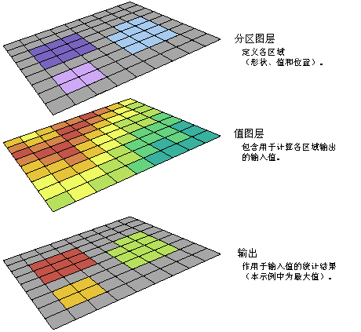
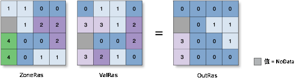

# 地理处理之空间分析

ArcGIS Spatial Analyst 为栅格（基于像元的）数据和要素（矢量）数据提供一组类型丰富的空间分析和建模工具。据我所知，这也是水文水资源领域用的最多的工具箱了。

Spatial Analyst 的功能已按功能相关性分成不同的类别或组。了解其类别有助于确定要使用哪种特定工具。不过类别也很多，因此这里根据实际使用情况，简单记录下需要用到的类别的具体工具的基本功能。

## 区域分析

“区域分析”工具用于对**属于每个输入区域的所有像元执行分析**，输出是执行计算后的结果。虽然区域可以定义为具有特定值的单个区域，但它也可由**具有相同值的多个断开元素或区域组成**。区域可以定义为**栅格或要素数据集**。栅格必须为整型，而要素必须拥有整型或字符串类型属性字段。

有些区域分析工具会对输入区域的某些几何或形状属性进行量化，并且不需要其他输入。其他区域分析工具使用区域输入来定义将用于计算其他参数的位置，如统计数据、面积或值频数等。还有一种区域分析工具用于使用沿区域边界找到的最小值填充指定区域。

### 分区统计

其基本内容是计算**另一个数据集**的**区域内栅格数据值**的**统计信息**。用于根据来自其他数据集的值（**赋值栅格**）为每一个**由区域数据集定义的区域**计算**统计**数据。为输入区域数据集中的每一个区域计算单个输出值。示例如下图。

具体的计算规则：

OutRas = ZonalStatistics(ZoneRas, "VALUE", ValRas, "MINIMUM")

如图所示，左边的ZoneRas图表示区域，相同数字的栅格代表一个区域，区域内求最小值，且相同数字的区域可以是不相邻的，比如0代表的区域就在不相邻的位置。

如果区域输入为栅格数据集，且区域输入和值输入均为具有相同分辨率的栅格，则可直接使用它们;如果分辨率不同，则可先应用**内部重采样**以使其相一致，然后再执行区域操作。

区域输入必须具有属性表，通常会自动为整型栅格数据创建属性表，但是某些情况下可能不会这样做。这时候可以使用**构建栅格属性表**来创建一个属性表。

如果区域输入是**要素数据集**，则可在内部**对其应用“矢量至栅格”转换**。要**确保转换结果与值栅格完全对齐**，建议您进行检查以确保环境设置和栅格设置中的范围和捕捉栅格设置正确。

也就是说，对于矢量图做区域输入时，需要先把矢量图转为栅格图，然后确保该区域栅格图和数据栅格图的栅格能一一对应，这样才满足计算条件，然后执行区域内各像素计算。

由于内部栅格必须具有**属性表**，因此在转换中**不创建属性表的情况下将会发生错误**。如果发生此错误，则使用要素转栅格、面转栅格、点转栅格或折线转栅格直接**转换要素数据集。并为其生成属性表**，然后使用生成的栅格作为“区域”输入。

另外如果区域要素输入具有**叠置的面**，则**无法为每一个单独的面执行区域分析**。因为要素输入已转换为栅格，所以每个位置只能拥有一个值。

综上，最好是使用栅格数据做输入，因此如果是矢量数据，要先手动操作转栅格，如果是有重叠的矢量图，还需要把矢量图制作成没有重叠的情况。