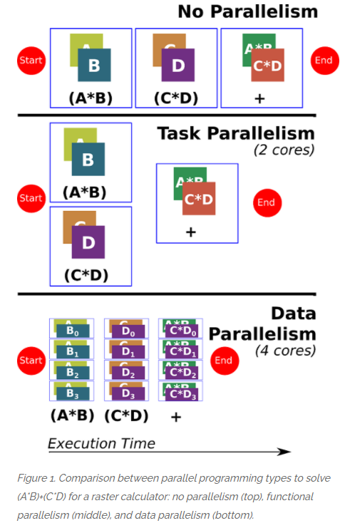
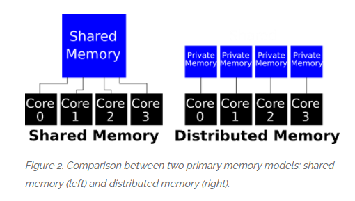
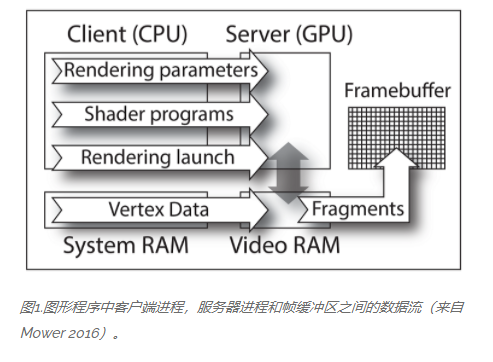

# 并行GIS编程

本文主要参考以下资料, 简单了解GIS并行中涉及到的基本概念.

从最基础的并行GIS开始并不适合我这样的非GIS专业人员, 所以简单了解一些概念即可, 更多地还是跟随GIS开源社区, 灵活使用较好的工具.

- [GIS and Parallel Programming](https://gistbok.ucgis.org/bok-topics/gis-and-parallel-programming)
- [Parallelizing GIS with Geopandas and Multiprocessing in Python](https://swanlund.space/parallelizing-python)
- [Exploring the potential of using your teenager's gaming computer as a high
performance computing (HPC) GIS workstation](https://www.geos.ed.ac.uk/~gisteac/eeo-agi/2016-17/3_lembo_04112016.pdf)
- [GPU Programming for GIS Applications](https://gistbok.ucgis.org/bok-topics/gpu-programming-for-gis-applications)
- [Introducing 🌍 Xarray-Spatial: Raster-Based Spatial Analysis in Python](https://makepath.com/introducing-xarray-spatial-analysis-in-python/)
- [Geospatial Operations at Scale with Dask and Geopandas](https://towardsdatascience.com/geospatial-operations-at-scale-with-dask-and-geopandas-4d92d00eb7e8)
- [Fast GeoSpatial Analysis in Python](https://matthewrocklin.com/blog/work/2017/09/21/accelerating-geopandas-1)

可以参考的repo有:

- [python-geospatial](https://github.com/giswqs/python-geospatial)
- [xarray-spatial: Raster-Based Spatial Analysis in Python](https://github.com/makepath/xarray-spatial)
- [dask-rasterio](https://github.com/dymaxionlabs/dask-rasterio)
- [dask-geomodeling](https://github.com/nens/dask-geomodeling)
- [cuSpatial - GPU-Accelerated Spatial and Trajectory Data Management and Analytics Library](https://github.com/rapidsai/cuspatial)

## GIS and Parallel Programming

编程是GIS中广受欢迎的技能，但是传统编程（也称为串行编程）仅使用一个处理核。现在，现代台式机，笔记本电脑甚至手机都具有多个处理核，可以同时使用它们来提高一系列GIS应用程序的处理能力。并行编程是一种编程类型，涉及同时使用多个处理核来解决问题，这使GIS应用程序能够利用从台式计算机到超级计算机的现代计算体系结构上的更多处理能力。高级并行编程可以利用高性能计算资源上的成千上万个内核来处理大型空间数据集或运行复杂的空间模型。

并行编程既是一门科学，又是一门艺术。尽管有一些方法和原理适用于并行编程，但何时，如何以及为什么将某些方法应用于特定GIS应用程序中的其他方法仍然是一门艺术，而不是一门科学。以下各节介绍并行编程的概念，并讨论如何并行处理空间问题和测量并行性能。

并行编程使应用程序可以利用更多的处理能力，这可以带来很多好处。一个关键的好处是更快的执行时间来完成计算任务。这对于可能需要数小时甚至数天的大型计算任务而言非常重要。更多的处理能力还可以使应用程序解决以前由于内存/计算约束而无法解决的问题，从而开辟了解决复杂空间问题的新方法。或者，更大的处理能力可以使GIS学者或从业人员能够在与非并行应用程序相同的时间内进行更全面的分析或运行更多的模拟。并行应用程序可以利用各种不同的并行处理体系结构，包括多核处理器，图形处理单元（GPU）或加速器。

### 如何使地理空间问题平行化

GIS开发人员编写程序来帮助解决地理空间问题。GIS应用程序中通常使用两种并行编程：data parallelism 数据并行性和 functional parallelism功能并行性。每种类型都有优点和缺点，下面将对此进行讨论。可以同时使用两种类型来增加并行度，这称为混合并行。 

数据并行性涉及将空间数据（例如，一组矢量要素或栅格像素）划分为多个较小的数据集。分区的数据被分发到多个内核以进行并行处理。此过程称为spatial domain decomposition空间域分解。数据集越大，数据并行性的好处越大。如果数据如此之大，以至于没有任何一台计算机能够处理这些数据，则可以使用数据并行性来使多台计算机对数据进行分割和并行处理。有多种方法可以分解空间数据。常见的分解策略包括row decomposition行分解（通常是最简单，最常见的），column decomposition列分解和grid decomposition网格分解（类似于棋盘）。递归分区策略（例如四叉树和递归二等分）会将空间不规则的数据（例如点，线和多边形）划分为越来越小的分区，并小心地平衡每个子分区中的数据量。

功能并行性（有时称为任务并行性）对一系列任务进行分区，并分配可以同时完成的任务。当有许多任务时，这种并行形式最有效。示例包括在遥感中处理数千个图像图块，运行数十个空间模型或在基于蒙特卡洛的空间统计中运行数百个模拟。在每种情况下，任务之间几乎没有交互，因此很容易在多个处理核心之间划分任务。与数据并行性相比，功能并行性更易于实现，因为数据保持不变。但是，它需要足够的任务才能分区并分配到多个内核。

一个简单的栅格计算示例说明了无并行性，功能并行性和数据并行性之间的差异。

在此示例中，使用四个栅格来计算（A * B）+（C * D）。在非并行方案中，首先应用程序计算A * B，然后计算C * D，最后将两个结果栅格相加以获得最终答案。在功能（或任务）并行性示例中，两个乘法可以作为并行的两个内核上的单独任务执行。最终的添加任务将在单个内核上执行。注意，由于同时执行的任务不超过两个，因此只能使用两个内核来并行化计算。在数据并行性方案中，使用四个内核（甚至更多个内核）来处理分区的栅格数据（使用行分解）。由于栅格数据通常具有数百行或数千行，可以在数十个甚至数百个内核之间进行划分，因此此方案可以使用两个以上的内核。每个核心处理一个子域（图1中标记为0-3的一组行），首先通过计算A * B，然后计算C * D，最后将结果子域相加以获得最终答案，该最终答案合并为一个栅格。

对于GIS应用程序，存在一些并行编程语言和并行策略。例如，Parallel Cartographic Modeling Language并行制图建模语言是一种自定义编程语言，它隐藏了一些并行编程的复杂性。已经有一些并行策略被创建，以使并行程序适应GIS应用程序的不同并行计算平台。常见的平台不仅包括多核处理器，而且包括越来越多的GPU，这些GPU通常使用Compute Unified Device Architecture（CUDA）进行编程，而读取器称为图形处理单元。

### 如何并行协调数据和执行

一旦通过数据和/或任务并行性分解了问题，GIS应用程序必须协调所有并行核心之间的数据发送，接收和处理。从磁盘读取数据并将其存储在内存中。有两种主要的用于并行计算的内存模型：shared memory共享内存和distributed memory分布式内存。

共享内存模型假定所有处理核心都可以访问单个共享内存。共享内存模型提供了一种共享数据的简便机制，但是，多个内核写入同一数据可能会导致竞争状态，从而导致值不一致。要解决此挑战，需要使用锁和原子操作。锁用于“锁定”内存的特定部分，以便其他任何内核都不能使用它，并通过确保另一个内核在被锁定时无法对其进行修改来消除竞争状况。原子操作可确保在执行操作期间无法修改内存。通常，多线程计算是为共享内存模型开发程序的最常用方法。在这种情况下，GIS应用程序将启动多个都可以访问共享内存的线程。用于多线程编程的两个广泛使用的库是[OpenMP](www.openmp.org)和[OpenCV](www.opencv.org)软件包。

分布式内存是一种不同的内存模型，其中每个内核都有自己的私有内存，其他内核无法访问该私有内存。此模型中的数据交换是显式的，因为内核无法访问彼此的内存，因此应用程序需要一种交换信息的方法。消息传递是最常见的方法，其中内核相互发送包含数据和/或协调信息的消息。消息传递的最常见标准是 Message Passing Interface消息传递接口，由于其被广泛采用，它可在世界各地的每台大型超级计算机和集群中使用。

### 如何并行编程

有两种常见的程序并行化方法： master/slave 主/从和fully distributed完全分布式。主/从范例是并行化程序的最常见方法，特别是对于初学者，因为它易于理解和实现。在此范式中，GIS应用程序是主应用程序，它将启动许多作为从属的线程或进程。主进程将工作交给从属进程，并将结果返回给主进程。在这种范式下，从属进程很少与其他从属进程进行通信，而所有通信都是通过主进程进行的。这简化了通信（称为inter-processor communication处理器间通信），但可能会产生阻塞（称为computational bottleneck计算瓶颈），因为一个主机可能会被许多从属进程overwhelmed。从站分配工作有两种主要方式：从共享队列中拉出或从主站分配工作。如果主服务器和所有从属进程都可以使用共享的“工作”队列，则当从属服务器准备完成一个工作单元时，他们将从队列中拉出一个工作单元并开始计算。完成后，他们将拉动另一个工作单元。如果队列为空，则从服务器退出，因为没有更多工作要做。然后，主服务器负责为所有从服务器填充工作队列。第二种情况是从服务器向主服务器发出“工作请求”，然后主服务器将工作单元分配给从服务器。在这种情况下，从属进程之间没有共享信息，而是所有内容都通过主控进程进行显式通信。

一旦问题足够大并且开发人员已经获得并行编程经验，则完全分布式的范例将更为常见。在这种范式中，没有主节点，当从节点（即核心）过多时，这可能成为瓶颈。尤其是在并行使用数百或数千个处理核心的情况下，单个主机可能难以继续向所有这些核心提供任务和数据。为了解决这个问题，开发人员可以创建完全分布式的代码，其中所有内核通过处理器间通信并行地协调其活动。由于没有单个主节点，因此没有单个瓶颈。需要仔细考虑以确保按照预期的过程完成所有任务，并确保过程本身设计合理，否则可能会发生诸如数据覆盖和死锁的问题。在计算机科学领域，已经对这类并发问题进行了广泛的研究。一个典型的例子是[哲学家就餐问题](https://zh.wikipedia.org/wiki/%E5%93%B2%E5%AD%A6%E5%AE%B6%E5%B0%B1%E9%A4%90%E9%97%AE%E9%A2%98)，用来演示在并发计算中多线程同步（Synchronization）时产生的问题。

假设有五位哲学家围坐在一张圆形餐桌旁，做以下两件事情之一：吃饭，或者思考。吃东西的时候，他们就停止思考，思考的时候也停止吃东西。餐桌中间有一大碗意大利面，每位哲学家之间各有一只餐叉。因为用一只餐叉很难吃到意大利面，所以假设哲学家必须用两只餐叉吃东西。他们只能使用自己左右手边的那两只餐叉。

哲学家从来不交谈，这就很危险，可能产生死锁，每个哲学家都拿着左手的餐叉，永远都在等右边的餐叉（或者相反）。

即使没有死锁，也有可能发生资源耗尽。例如，假设规定当哲学家等待另一只餐叉超过五分钟后就放下自己手里的那一只餐叉，并且再等五分钟后进行下一次尝试。这个策略消除了死锁（系统总会进入到下一个状态），但仍然有可能发生“活锁”。如果五位哲学家在完全相同的时刻进入餐厅，并同时拿起左边的餐叉，那么这些哲学家就会等待五分钟，同时放下手中的餐叉，再等五分钟，又同时拿起这些餐叉。

在实际的计算机问题中，缺乏餐叉可以类比为缺乏共享资源。一种常用的计算机技术是资源加锁，用来保证在某个时刻，资源只能被一个程序或一段代码访问。当一个程序想要使用的资源已经被另一个程序锁定，它就等待资源解锁。当多个程序涉及到加锁的资源时，在某些情况下就有可能发生死锁。例如，某个程序需要访问两个文件，当两个这样的程序各锁了一个文件，那它们都在等待对方解锁另一个文件，而解锁永远不会发生。

这个看似简单的问题需要仔细思考以解决和创建并行程序，确保没有过程陷入僵局（或哲学家饥饿）是具有挑战性的。简化此问题的一种方法是使用同步，在该同步中，进程在同步点等待其他进程完成，这可以缓解一些并发问题。此外，寻找和修复错误（即调试并行程序）可能既困难又耗时，这是为什么无论初学者还是高级并行程序员都首选使用主/从的原因之一。

### 如何衡量并行性能

一旦有了并行程序，如何知道它是否运行良好？更快的执行时间是一个很好的指标，但是仅凭执行时间就很难确定程序是否以最佳方式执行。并行化GIS应用程序可通过两种主要方法来衡量性能提升：速度和效率。

与在单个内核上运行的时间相比，Speedup测量了N个内核上的执行时间。Speedup比执行时间更好。尽管在设计良好的并行应用程序中执行时间通常会减少，但是如果给定越来越多的处理核心，则仅凭执行时间就很难判断应用程序是否达到了出色的性能。例如，如果单个内核上的执行时间为几分钟，则添加16个内核时执行时间减少38秒可能被认为是出色的，但是如果单个内核上的执行时间为数小时，则可以认为是差的。这主要是由于这样的事实，即每2小时执行时间减少38秒对整体性能的影响有限，尤其是在为应用程序提供16倍以上的内核时，但是将43秒的执行时间缩短38秒确实会影响整体性能。Speedup有助于评估我们的应用程序在给定数量的内核（N）上运行的速度。

Speedup=串行程序的执行时间/ N核上的并行程序的执行时间

为了了解应用程序与理论上最佳加速的接近程度，我们使用效率的度量。它测量应用程序与理论上最佳加速的接近程度，范围为0-100％。

效率=Speedup/ N

下表提供了并行应用程序的假设执行时间，并计算了加速和效率。注意执行时间是如何减少的，这看起来很令人兴奋，但是效率急剧下降，表明并行性能下降。诱人的想法是，添加X内核将实现X加速。但是，情况并非如此，可以使用经典的并行计算定律来证明这一点。

Hypothetical Execution Times, Speedup, and Efficiency for a Parallel Program

|Number of Cores	|Execution Time (seconds) 	|Speedup	|Efficiency|
|-|-|-|-|
|1	|100	|1.0	|100%|
|2	|58	|1.72	|86%|
|4	|36	|2.77	|69%|
|8	|22	|4.54	|56%|

在给定问题大小的情况下，Amdahl's Law 阿姆达尔定律计算并行应用程序的理论速度。它说明了为什么真正的应用程序永远无法真正实现线性加速，因为并行应用程序始终具有串行执行的某些部分，例如启动过程，锁定和关闭过程。随着并行度的提高，即使串行执行的看似很小的部分也可能占总执行时间的大部分，这会降低总体并行效率。了解GIS应用程序的并行部分和串行部分之间的关系对于评估可以通过精心设计的并行程序实现的实际加速至关重要。

了解了 speedup，效率以及通过阿姆达尔定律进行的并行化的理论极限后，如何评估GIS应用程序的并行性能？有两种主要方法：strong scaling 强缩放和weak scaling弱缩放。强扩展针对固定的问题大小评估并行应用程序的可伸缩性。换句话说，问题的大小保持不变，而核心数却增加了。弱扩展会评估并行应用程序的可伸缩性，以解决随内核数量而增长的问题。换句话说，问题的大小随着core数量的增加而线性增加。强扩展通常是默认的评估标准，因为它证明了并行应用程序可以解决问题的速度。

最后稍微补充下GPU+GIS方面的概念，因为GPU编程需要的基础暂不具备，所以只是简单了解一些概念。

## GPU Programming for GIS Applications

CPU有摩尔定律，即单位面积晶体管数量两年能翻一番，不过摩尔定律也有一些限制，比如散热，晶体管太小也有物理限制。在计算加速方面，人们也早已经用并行来处理问题，比如多核CPU。另外，GPU并行也是一个不错的选择，比如著名的NVIDIA的CUDA for GPGPU’s：Compute Unified Device Architecture for General Purpose computing in the GPU。这对于大型地理空间计算也是很不错的选项。

下面是一些GPU相关的术语：

- 图形处理单元 Graphics Processing Unit (GPU)： 由处理器，寄存器和dedicated random access memory组成的计算机硬件模块。GPU可以集成在桌面，移动或云计算平台内。
- Rendering Pipeline 渲染管线：一种高度优化的并行处理环境，用于将3D vertex 数据渲染到像素。理想情况下，所有vertex （和所有像素）都在专用处理器上相互独立处理。在实践中，GPU物理处理器托管虚拟处理器组。
- Framebuffer 帧缓冲区： 视频随机存取存储器（VRAM）位置的集合，其中包含映射到显示区域的数字颜色值。
- 图形处理单元上的通用计算 General-purpose computing on graphics processing units (GPGPU)： 并非主要针对图形输出的GPU编程。
- Client-Server Processing 客户端-服务器处理： 用于大多数GPU计算的处理模型，其中CPU（中央处理单元）是客户端，它在充当服务器的GPU上启动程序。在某些GPGPU环境中，这种关系可以描述为主机设备处理。
- Texture ：一维或二维数据结构，其元素在位置指定颜色或通用数值。
- Shader编程语言： 一种主要面向图形的编程语言（例如GLSL或HLSL），用于在GPU上进行代码开发。
- Shader Program (or Shader)：用 Shader编程语言编写的程序，可在GPU上执行并与渲染管线交互
- Shader Stage 着色器阶段： 渲染管线中几个可编程处理阶段之一。每个着色器阶段都理解一种独特的编程语言，该语言与同一语言组中的其他语言略有不同。
- Compute Shader Stage：着色器程序中的一个阶段，该阶段执行GPGPU风格的计算而无需与渲染管线交互
- Shader Instance 着色器实例： 与给定着色器阶段的唯一虚拟处理器关联的单个执行线程。
- Uniform variable 统一变量：与着色器阶段有关的只读变量，其值在包含的着色器程序执行开始时由客户端提供。
- 着色器存储缓冲区对象 Shader Storage Buffer Object (SSBO)：绑定到服务器缓冲区的客户端数据缓冲区，通常用于客户端和服务器之间的数据传输。

现代GPU采用大规模并行计算体系结构，对于许多应用程序领域，它通过顺序计算替代方案提高了整体数据吞吐量。从早期的仅包含16个处理器的GPU演变而来，现代高端台式机系统现在包含3,800多个处理器（或内核）。GPU云计算服务托管各种编程语言和开发环境，可提供对高性能GPU的远程访问，以在图形处理单元应用程序上构建图形和通用计算（GPGPU）。其中包括机器学习和图像处理任务以及3D渲染应用程序（Esri当前提供了ArcGIS Desktop虚拟化环境作为用于映射图形应用程序的云GPU解决方案）。GPU的物理位置在很大程度上与开发人员无关-相同的编程语言适用于台式机和云系统。

图形和GPGPU程序均从“客户端”进程（对于图形应用程序）或“主机”进程（对于GPGPU应用程序）启动。下图说明了典型图形应用程序在客户端和服务器之间的数据流。

客户端（或主机）进程（通常在具有常规CPU的本地计算资源上执行）将一组GPU源代码文件编译并将其链接到程序中，将编译后的程序绑定（复制）到GPU（服务器或设备），并开始执行。给定GPU可以理解的编程语言取决于其设备驱动程序中包含的开发工具和定义。服务器/设备程序的编译，链接和执行的特定方式取决于语言。客户端-服务器（主机设备）编程语言比较流行的比如：

GPU Programming Environment Characteristics

|Environment	|Maintained By	|Application Domain	|Additional Supported Device / Server Languages|
|-|-|-|-|
|OpenGL	|Khronos Group	|Graphics	|GLSL|
|DirectX	|Microsoft	|Graphics	|HLSL|
|CUDA	|NVIDIA	|GPGPU	|Not Applicable|
|OpenCL	|Khronos Group	|GPGPU	|Not Applicable|

上面这些基本都听说过，因为深度学习，CUDA是自己计算中会碰到的。后面会有很多记录是和图形化处理相关的词，大概了解下即可，不必都认识。

大多数GPU服务器程序以一种或多种方式对客户端提供的数据进行操作。图形客户端程序通常将一组 vertices（可能与其他数据交错，例如表面法线，纹理坐标等）复制到服务器端程序（通常称为着色器程序）作为输入流。 “渲染管线”，一系列高度优化的处理阶段，可将3D顶点坐标转换为视频帧缓冲区中的彩色像素。其他数据通道，例如纹理（映射的1D或2D图像属性数据），着色器存储缓冲区对象（类似于C struct类型的数组）和统一变量（从客户端复制的只读标量数据），可以为服务器提供几乎无限多种属性数据。尽管某些数据通道相对于服务器为“只读”，但其他数据通道则允许在渲染过程完成时对客户端可见的修改。可见性的价格有时是将数据从服务器复制回客户端所需的时间中的一笔可观的成本。“图形处理单元上的通用计算”或GPGPU类别中的程序将类似的机制应用于客户端与服务器（或主机与设备）之间的数据传输，但很少与渲染管道交互。

并行计算解决方案的效率很大程度上取决于在任何给定时间用于处理问题的处理器比例。某些类型的问题（称为“embarrassingly parallel”）与其他处理器的通信几乎不需要同步。例如，如果帧缓冲区中的每个像素都由唯一的处理器表示，则它们中的任何一个都可以查询其当前颜色值并通过查阅查找表进行交换。无需与其他像素通信。在另一个极端，诸如“ drainage accumulation modeling over a DEM”之类的“固有顺序”问题需要通过广泛的处理器间通信的continuous flow updates。当多个处理器需要引用同一个内存位置(如排水网中排水到第三的共同downhill vertex两个uphill vertices),程序员必须确保每个uphill vertex 的flow添加到其流向下坡的邻居前看到最新的数据。

这可以通过允许一个 uphill processor “锁定”公用的 downhill memory location ，直到通过“原子”操作完成其内容的添加来实现。这种同步可防止其他uphill processor将其内容添加到陈旧（无效）值中。被阻塞的处理器将保持空闲状态，直到清除阻塞条件为止。不这样做可能会产生不确定的结果。同步通常意味着效率降低，因为同时活动的处理器数量减少了。

大多数GPU环境都提供了单指令多数据（SIMD）计算的一种变体，其中一部分处理器（有时称为工作组）共享在每个成员处理器的本地数据上以锁步方式执行的单个公共处理线程。给定工作组中的处理器相对于其他工作组中的处理器异步运行，这意味着单程序，多数据（SPMD）编程模型。

并行程序相对于功能等效的顺序程序在性能上的优势称为“加速因子”。如果100个单元的阵列需要100个时间单位来顺序处理，则如果100个可用物理处理器（每个宿主一个单独的阵列单元）能够在其中运行任务，则同一阵列在GPU上可能需要1个时间单位。 1个时间单位，相对于所有其他处理器完全异步。尽管在实际系统上不太可能实现这种潜在的100倍加速，但是它可以提供对性能预期的高端估计。

 GPU可以托管各种图形和GPGPU处理模型。像CUDA这样的GPGPU语言通常不与渲染管道交互，因此不受视频刷新约束，它们倾向于为异步处理器控制流和处理器间同步提供广泛的实用程序。

可以从同一客户端程序执行以CUDA编写的GPGPU程序和以OpenGL或DirectX编写的图形程序。另外，OpenGL和DirectX都提供了一个计算着色阶段，该阶段允许GPGPU计算而无需与渲染管线进行交互，并且提供了接近纯GPGPU语言（例如CUDA和OpenCL）提供的控制级别的同步实用程序。如果GPGPU任务不需要复杂的阻止技术，则在渲染管线通过之前或之后使用计算着色器可能是将图形为主的应用程序与CUDA交叉链接的一种可行选择。

因为CUDA和渲染管线交互不多，所以这里就不记录渲染管线相关的东西了。下面看看图形处理单元（GPGPU）上的通用计算。

GIS和遥感应用程序（例如图像拉伸，坐标转换，图像变形等）可以从GPGPU编程获得的数据吞吐量中受益。GPGPU程序（如着色器程序）通常将单个数据元素与唯一的虚拟处理器关联。了解从多核CPU实施到早期GPU解决方案的遥感应用并行解决方案的历史。

下表列出了最常用的专有和开源GPGPU编程语言。作为NVIDIA的专有产品开发和维护的CUDA等语言，以及由Khronos Group监督的开源语言OpenCL，共享许多GPU编程方法和数据结构。由于CUDA应用程序限于NVIDIA硬件，因此OpenCL更常用于跨平台开发。但是，OpenCL程序可能需要更多的手动优化才能获得与功能上等效的CUDA程序相当的性能。CUDA和OpenCL库绑定适用于许多标准编程语言，包括C，C ++和Python。DirectCompute具有OpenCL的许多特性，但是专有并且仅限于在Microsoft Windows DirectX媒体环境中执行。

Common GPGPU Programming Languages

|Language	|Open Source	|Developer	|Characteristics and Use|
|-|-|-|-|
|CUDA	|No	|NVIDIA	|Direct GPU programming and backend GPU processing through CPU applications (limited to NVIDIA hardware)|
|OpenCL	|Yes	|Khronos Group 	|Cross-platform GPGPU standard|
|DirectCompute	|No	|Microsoft	|GPGPU programming for Microsoft Windows DirectX environments|
|OpenACC	|Yes	|Cray, CAPS Enterprise, NVIDIA, PGI	|Standard for mixed CPU/GPU parallel programming|

CUDA，OpenCL和DirectCompute程序开始在主机CPU上执行，并且通常通过使用创建主机和GPU均可见的内存空间的功能使数据可用于GPU（设备）。CUDA程序必须另外指定将并行运行以解决给定问题的线程数，并在函数定义之前添加限定标签，以指示是否应允许它在GPU上并行运行。简单的CUDA应用程序通过与相对比的顺序应用程序的高度相似而受益，并增加了相对较少的关键字和功能。

CUDA还提供了许多使用MATLAB或现代图形库的用户熟悉的矢量数据类型。一些示例是2D，3D和4D矢量类型的float2，float3和float4，对于float2具有属性x，y，对于float3具有x，y，z属性，对于float4具有x，y，z，w。类似地提供了与这些向量类型（MatAdd（），MatMul（）等）兼容的矩阵代数运算。

许多程序员会选择通过诸如MATLAB之类的应用程序间接使用CUDA或另一种GPGPU语言。在这种方法下，开发人员可以继续使用熟悉的编程界面，而不必了解GPU程序执行的详细信息。许多为MATLAB编写的机器学习项目都使用这种方法。

并行计算解决方案相对于同类顺序解决方案的提速因子取决于许多因素，其中最重要的因素在此处列出：

- 比较顺序和并行解决方案的优化程度
- 经过测试的CPU内核的数量和性能特征
- 经过测试的物理GPU内核的数量和性能特征
- 可用RAM和VRAM的数量
- GPU和CPU资源之间的数据传输速度

类似地，以2种不同语言编写时，两种在功能上可比的并行实现的运行相对速度在很大程度上取决于编码的并行编程解决方案的效率以及生成的编译代码。

云计算服务正迅速成为GPGPU应用程序的首选平台。NVIDIA Nimbix，亚马逊AWS，IBM Cloud和Microsoft Azure都为CUDA提供GPGPU环境，以及对OpenCL，OpenGL和DirectX的更有限的支持。供应商通常按小时收费以计算时间。在这些服务中，NVIDIA Nimbix提供的服务接口最类似于带有附加GPU的桌面环境中的客户端-服务器编程任务。这些供应商提供的许多其他服务在后台隐式使用了GPU计算。

随着台式机，移动设备和云计算环境中高性能GPU的普及，可以合理地预期，制图和GIS中的图形应用程序将越来越多，而遥感中计算密集型问题的数量将会增加。调用GPU平台实现的解决方案。这可能会增加可用的增强现实和动画制图产品的范围和复杂性，并促进在大型空间数据集合上运行的GIS和遥感技术中的项目。