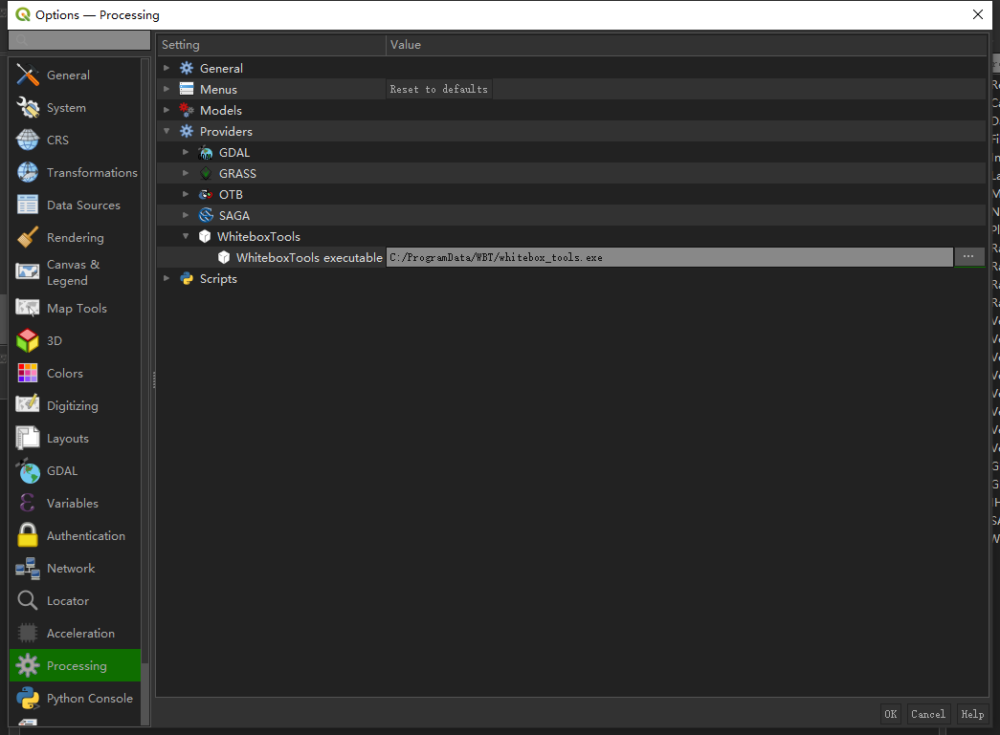
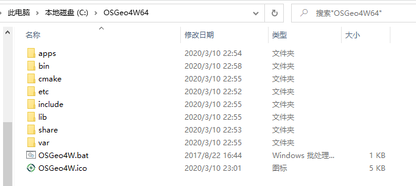
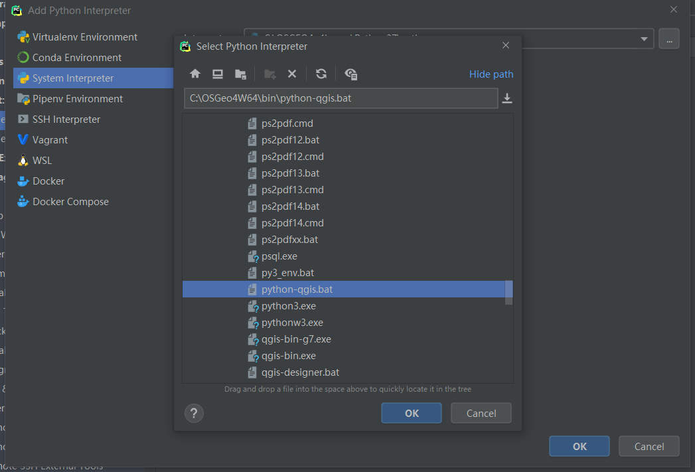

# QGIS 安装及配置

QGIS从安装开始。

## QGIS 安装及 PyQGIS

这部分请参考[这里](https://github.com/OuyangWenyu/hydroGIS/blob/master/AutoGIS/6-python-qgis.md)

直接使用QGIS，不结合其他工具代码操作的话，后面就不用看了。

## 安装whitetoolbox插件

首先，下载WhiteBoxTools工具：https://www.whiteboxgeo.com/download-whiteboxtools/ ，我的是windows，所以直接下载windows版本，填写信息让开发者知道你，然后就能下载了。

因为这里要在QGIS下使用它，所以查看[这里](https://www.whiteboxgeo.com/manual/wbt_book/qgis_plugin.html)，根据文档说明来安装插件即可，这里就不赘述了，简而言之就是先添加插件下载源地址，然后再安装插件，如果添加源后没有搜到插件，就尝试重启下QGIS，如果还不行，可能是QGIS的版本问题，更新版本试试，更新的方式可以参考[这里](https://opensourceoptions.com/blog/how-to-install-or-update-qgis/)。

QGSI的whiteboxtools插件并不自带whiteboxtools的具体核心代码，所以还需要指定插件指向的具体代码位置，将之前下载的WhiteBoxTools解压，然后放到自己想放的地方，接着配置如下：



## 在命令行/IDE中使用PyQGIS

如果需要在 PyCharm中能够连接到PyQGIS，可以参考[How to set environment for PyQGIS 3 in PyCharm](https://haifengniu.com/en/post/pyqgis-pycharm/how-to-set-environment-for-pyqgis-3-in-pycharm/),[PyCharm Directions](https://opensourceoptions.com/courses/topic/pycharm-directions/) 来设置开发环境。

当然前提是安装好PyCharm和 QGIS(OSGeo4W Network)，PyCharm的安装可以参考：https://github.com/OuyangWenyu/hydrus/blob/master/1-basic-envir/2-python-envir.ipynb ，QGIS的安装可以参考：https://github.com/OuyangWenyu/hydroGIS/blob/master/AutoGIS/lesson7.ipynb ，这里就不赘述了。

安装好之后，来设置环境，这里是windows下的操作。我的QGIS版本是3.12的，从 安装之后，根目录如下所示：



接下来要创建两个bat文件来帮助我们在pycharm中运行QGIS。第一个是pyqgis.cmd文件，用来为PyQGIS设置环境，使得我们能在命令行下执行python就能调用qgis的程序。

首先进入 ./OSGeo4W 文件夹（即根目录，我的是默认安装，所以如上图所示在C:\OSGeo4W64），然后创建一个 pyqgis.cmd（pyqgis.bat也行） 文件，将以下内容粘贴进去（注意每行路径都要与自己安装的内容对应）：

```Shell
@echo off
SET OSGEO4W_ROOT=C:\OSGeo4W64
call "%OSGEO4W_ROOT%"\bin\o4w_env.bat
call "%OSGEO4W_ROOT%"\bin\qt5_env.bat
call "%OSGEO4W_ROOT%"\bin\py3_env.bat
call "%OSGEO4W_ROOT%"\apps\grass\grass78\etc\env.bat
@echo off
path %PATH%;%OSGEO4W_ROOT%\apps\qgis\bin
path %PATH%;%OSGEO4W_ROOT%\apps\grass\grass78\lib
path %PATH%;C:\OSGeo4W64\apps\Qt5\bin
path %PATH%;C:\OSGeo4W64\apps\Python37\Scripts

set PYTHONPATH=%PYTHONPATH%;%OSGEO4W_ROOT%\apps\qgis\python
set PYTHONHOME=%OSGEO4W_ROOT%\apps\Python37
set QT_PLUGIN_PATH=%OSGEO4W_ROOT%\apps\qgis\qtplugins;%OSGEO4W_ROOT%\apps\qt5\plugins

set PATH=C:\Program Files\Git\bin;%PATH%

cmd.exe
```

直接双击这个批处理文件进入一命令行，输入python，然后：

```Python
import qgis.core
import PyQt5.QtCore
```

应该不会报错，这样就是可以从命令行调用PyQGIS了。

接下来，创建另一个文件，pycharm.cmd（.bat也行）。粘贴如下内容进去即可。

```Shell
@echo off
SET OSGEO4W_ROOT=C:\OSGeo4W64
call "%OSGEO4W_ROOT%"\bin\o4w_env.bat
call "%OSGEO4W_ROOT%"\bin\qt5_env.bat
call "%OSGEO4W_ROOT%"\bin\py3_env.bat
call "%OSGEO4W_ROOT%"\apps\grass\grass78\etc\env.bat
@echo off
path %PATH%;%OSGEO4W_ROOT%\apps\qgis\bin
path %PATH%;%OSGEO4W_ROOT%\apps\grass\grass78\lib
path %PATH%;C:\OSGeo4W64\apps\Qt5\bin
path %PATH%;C:\OSGeo4W64\apps\Python37\Scripts

set PYTHONPATH=%PYTHONPATH%;%OSGEO4W_ROOT%\apps\qgis\python
set PYTHONHOME=%OSGEO4W_ROOT%\apps\Python37
set QT_PLUGIN_PATH=%OSGEO4W_ROOT%\apps\qgis\qtplugins;%OSGEO4W_ROOT%\apps\qt5\plugins

set PATH=C:\Program Files\Git\bin;%PATH%

start "PyCharm aware QGIS" /B "C:\Users\hust2\AppData\Local\JetBrains\Toolbox\apps\PyCharm-P\ch-0\193.6911.25\bin\pycharm64.exe" %*
```

可以看到除了最后一行是调用了pycharm之外，其他和上面的一样。当然，要注意自己的pycharm的位置是否正确，我的是用jetbrain toolbox安装的，所以在上面的位置里。

现在尝试双击这个刚创建的文件，看看会不会打开pycharm，双击之后稍等，即可发现pycharm已经打开。然后给项目或新建项目配置interpreter：



还有另一种方式就是直接尝试在conda环境下安装qgis：

```Shell
conda install -c conda-forge qgis
```

## 在QGIS中使用GEE

这部分主要参考了：[giswqs/qgis-earthengine-examples](https://github.com/giswqs/qgis-earthengine-examples)

按照其步骤操作。没有GEE就注册GEE，然后安装QGIS，这两步就不赘述了。

第三步在QGIS中安装 GEE 插件，并授权 GEE，参考：https://gee-community.github.io/qgis-earthengine-plugin/

QGIS插件使用EE Python API 整合了 GEE 和 QGIS，目前插件只实现了GEE Code Editor中常用的Map API的一部分。

插件可以从QGIS Plugin Repository安装，打开QGIS，在顶层菜单栏由“Plugins”，点击即可看到“Manage and Install Plugins”，在插件栏里找到“Google Earth Engine”，安装即可。

安装时候可能不会自动验证，根据：https://github.com/gee-community/qgis-earthengine-plugin/issues/35 ，参考：https://developers.google.com/earth-engine/guides/python_install ，首先 安装下 earthengine-api ，在自己的base下的conda环境里执行：

```Shell
pip install earthengine-api
```

然后在命令行下执行python，进入python环境后：

``` Python
import ee
ee.Authenticate()
```

授权之后，将授权码粘贴到命令行，然后就授权成功了。接下来：

``` Python
ee.Initialize()
```

然后再回头重新安装插件，会发现就安装成功了。

现在应该就可以通过 QGIS Python Code Editor 写脚本来使用插件了。 

为了验证插件是否安装成功，以及授权好，可以在QGIS Python控制台（Plugins栏下点击可进入）输入：

```Python
import ee
print(ee.String('Hello World from EE!').getInfo())
```

后面就 clone [giswqs/qgis-earthengine-examples](https://github.com/giswqs/qgis-earthengine-examples)项目来实践了。