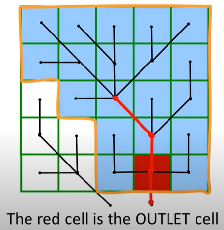
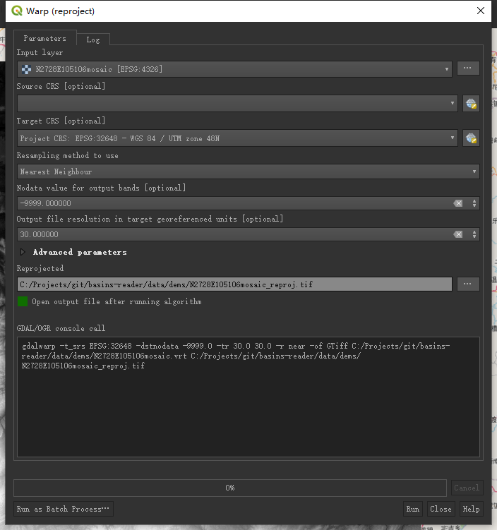

# QGIS中划分流域

本文主要参考[Youtube上Catchment Delineation with GIS系列视频](https://www.youtube.com/watch?v=ZLUjSEK-nbg&list=PLeuKJkIxCDj2Gk0CkcJ-QeviE41aMZd-5)学习如何使用QGIS划分流域。

## 如何划分流域

本节主要阐述以下内容：

- 流域术语
- 从DEM划分流域的基本步骤

### 流域

英语里流域对应的术语有catchment或watershed。在英式英语环境里，catchment指的是流域表示的区域，区域里所有水都会流向一个出口的，也称为drainage basin；watershed则是指流域边界。在美式环境下，watershed则是流域区域，流域边界线会称为drainage divide。各类GIS工具更多的还是用watershed来表示流域区域，英式英语下则是以catchment为主。这里后面不论用catchment还是watershed，都是指流域了，而且中文本来也没区分。

### 划分流域的基本步骤

流域划分步骤如下图所示，

这里先简单说明下各步骤内容，后面会更详细介绍。

1. 下载DEM tiles：首先需要从网络上下载DEM数据，常用的公开的数据源包括 SRTM 1 Arc Second Global（\~30m）、SRTM Void Filled（\~30m for US，\~90m for Global）、ASTER Global DEM（GDEM）(\~30m)，下载地址在[USGS的网站](https://earthexplorer.usgs.gov/),QGIS上也提供了SRTM的下载插件
2. 拼接DEM tiles：通常一个DEM tile不会正好包含所在的流域，所以需要拼接多个DEM文件
3. Reproject DEM：全球数据一般都是地理坐标系WGS84，为了使用DEM做后续计算，会将DEM投影到一个指定的坐标参考系。比如计算坡度，用focal运算，即需要根据周围的单元来一起计算，会计算所有周围单元和本单元之间高程的tangent，如果是地理坐标系用degree，因为地球球面不同维度下相同degree代表的而距离不同，所以这样直接计算导数是有点问题的，还是转换为投影坐标，用m单位好一些
4. Subset DEM：也就是切割DEM，一般情况下在我们拼接好DEM后，我们是不需要全部的DEM的，因为DEM越大，计算花费越大，所以还是切割一下较好，但是要注意不要切割太小，没把流域包含进来，所以还是要目视检查下DEM，看看大致的范围较好
5. Interpolate voids：voids就是空值，因为生成过程中的一些因素，DEM中会有一些空值，需要我们先通过插值等方式处理掉这些空值
6. Fill sinks：DEM中会有一些depression，即洼地，但是不是真正的洼地，也是DEM生成过程中的一些因素导致的错误，这些也需要处理，因为不处理的话，水流留到这就出不去了，GIS软件中会有 fill sinks的函数来处理；如果真的有lake这样的地方，remove掉之后还得把它们加回来
7. Burn-in the stream network: 如果有现成的河网图，则可以将河网加入到处理过程中来强迫flow direction算法遵守河网的流向
8. Calculate flow direction：通常会使用D8算法来计算流向，关于D8算法，可以参考[这里](http://www.gishydro.eng.umd.edu/documents/train_manual/old/dems.pdf)；另外有D-inf算法，即不用8个方向，而是使用连续方向，所以计算强度更大，但是不一定能获得更好的结果。
9. Derive streams：流向处理后，每个单元都有stream link，但是不是所有的单元都是河流的一部分，有两种方法来推求河流，一种是计算Flow accumulation，一种是Strahler order。Flow accumulation的意思也可以参考[这里](http://www.gishydro.eng.umd.edu/documents/train_manual/old/dems.pdf)，计算它之后，可以通过设置一个阈值来让大于该值的单元作为河流的一部分，不过设置阈值并不是太容易，一般情况下会尝试多个不同的值；另一种方法 strahler order 直接对联系起来的网上的分支做分级，分级方式如下图，然后也可以设置阈值来确定哪些级别以上为河流的部分，通常阈值需要结合已有的地图或卫星图像来率定。
10. Define outflow point: 需要在上一步划分出的河网上来做这一步，出口点是河上一点，可以是有流量站的点，可以是直流的出口点等
11. 划分流域：选定了点之后，就可以根据Flow direction确定流域范围了。
12. 转换到自己需要的格式：通常情况下最后还需要将处理好的数据转换成自己需要的文件格式

这种方法的局限在于在平坦的区域不适用，因为没有梯度，还是难划分流域的；还有就是人类获得影响较大的流域，比如有些低地国家会经常抽水来控制水流，也不适用。

## 操作实例

接下来，就在QGIS上具体操作一个实例。

使用SRTM来划分流域，首先安装下QGIS SRTM下载插件，具体方法可以参考[QGIS教程](https://docs.qgis.org/3.16/en/docs/training_manual/qgis_plugins/fetching_plugins.html)。为了更好地结合着地图来看，再安装一个quickmapservices插件，安装后这个插件可以在“Web”栏下找到，默认地应该是提供了NASA和OSM的一些地图，如果想要更多地图，可以在显示的“Settings”->“More services”里点击 "Get contributed pack"就能将更多地图加载进来了。

这里以赤水河为例了，尝试划分下流域。赤水河于重庆市西南的合江县汇入长江，所以我们感兴趣的区域在这附近选择，这附近的经纬度定到28-29N 105-106E，比较好的判断自己流域大致的笨方法是沿着自己关心的点往上游大致溯源下，这样一直溯源到头来判断范围，本文主要目的是介绍QGIS处理过程，所以比较粗略的看了看，生成的东西不能用于实际研究和应用。我们先换一个投影坐标系，关于坐标系的事，可以看看[这个博客](https://www.jianshu.com/p/6f3f00546f20)，小区域上常用投影系还是UTM，如果在6度范围内，使用UTM投影对地图属性的失真程度是比较小的（参考["映射两个 UTM 带的边界"](https://learn.arcgis.com/zh-cn/projects/choose-the-right-projection/)），全球分了60个UTM带，想找到这里感兴趣区域对应的带，可以直接QGIS界面右下角点击现在默认的“EPSG:4326”，搜索到UTM找到WGS 84 / UTM zone，然后试试不同的值就行了，对应赤水河的区域是WGS 84 / UTM zone 48N，EPSG编码是32648。

接着我们直接打开SRTM downloader插件（工具栏里应该有一个黑色小球可以直接打开，也可以在Plugins栏下面找到它）来设置DEM范围下载DEM数据，点击“set canvas extent”会自动填入当前界面展示的范围的坐标，可以修改到我们想要的28-29N 105-106E，这里为了执行下DEM拼接操作，稍微放大一些，用了默认给我的 27-30N 104-107E。然后要选择下载的文件路径。接着点击下载即可。这时候会弹出一个让输入warthdata账号和密码的窗口，如果你没有账号，就要[注册一个账号](https://urs.earthdata.nasa.gov/users/new)，注意科学上网下这些操作才会比较顺畅。

下面我们拼接DEM图，这里选择拼接27-28N 105-106E四个图，然后选择“Raster”->"Miscell..."->"Build virtual ...",input layers中选择这几个，然后如下设置：

可以看到qgis生成的GDAL命令，实际执行的就是这个命令，点击RUN运行，就可以看到拼接的DEM了，我们可以把多余的DEM移除QGIS，省的干扰我们执行后面的步骤。

接着reproject到目前的投影坐标系, "Raster"->"Projections"->"Warp ..."

现在切割一下感兴趣的区域，"Extraction"->"Clip Raster by extent ..."，在clipping extent一栏里可以选择“select extent on canvas” 就能绘图截选区域了。

现在开始处理DEM图了：fill sinks。打开“procssing”->“toolbox”，搜索fill sinks，按如下配置，然后run：

这个计算时间会稍微长一点，因为这个运算是比较耗费资源的。有时候可能运算会报错，那就关闭一些软件，然后重新run一遍。

可以安装一个“Profile tool”插件看看里面的高程变化。打开这个插件，选中刚生成的栅格图，然后点击“Add Layer”，画线，就能看到线上面各个点的高程变化，选中之前的栅格图，再点击“Add Layer”，点击颜色，可选择改变线的颜色，然后画线，就能看到fill前后高程的变化，在确实fill了的地方看会比较明显的。

接下来，好好可视化一下这个DEM图，右键它，选择“Properties”->"Symbology"，再设置如下：

最终设置是：

效果：

为了更好地可视化，一般会复制一下刚这个图，右键->“Dupilcate layer”即可，然后将它的颜色设置成hillshade，即太阳照射后的阴影（调整下图中的圈圈上指针可以改变展示结果）：

可以看到效果如下：

调整下彩色图的显示模式，就能看到叠加阴影的效果。

接下来计算 Strahler 分级，在Processing tool中搜索 Strahler，然后使用它：

局部效果是这样的：

可视化设置下：

局部效果：

选择分级阈值的话要采用试错的方法了，“Raster”->“Raster Calculator”，然后设置如下，先试试5：

和实际的地图底图去比较，可以看到有些不太好，所以换8再试试，我这里好像还是又有些河漏掉了，但是7好像又多了太多，所以因为我这里流量测点（即后面选的子流域出口点）都在8级及以上，所以暂时就先按8了。

接下来开始划分流域，在processing toolbox里面搜索channel，然后使用“channel network and drainage basins”，设置如下：

能看到有两个drainage basins，第一个是栅格数据，我们其实不需要，所以保存第二个Drainage basins即可。

结果显示flow direction的可视化效果不好，所以设置一下：

颜色八个方向能较好地区分开即可。255表示flat areas。

channel可视化也需要设置一下，点击图层左上角的styling按钮就会弹出如下所示右侧的配置栏：

然后配置如下：

流域图也可以配置下：

为了找到一个出口点的具体坐标，我们可以使用qgis插件 coordinate capture，这是一个核心插件，qgis会预装，插件栏里搜到它，然后勾选：

左下角就会出现这个工具了。

然后选择一个channel上的点作为流域出口点，这里选了离赤水河上测站很近的一个点。

然后搜索processing toolbox工具 upslope area，

打开后，把坐标粘贴进去，然后其他的设置如下：

run之后，就会看到生成的流域栅格图。

接下来我们把这个图转成矢量图。在Raster工具栏下找到“Conversion”->“Polugonize...”，设置如下：

打开生成的shpfile，如下使用红框中的工具就能把用不着的都手动删除掉。

最后再点击编辑键，会提示保存，保存即可。

得到shpfile之后，可以使用它来clip之前生成的各类图层，获取自己想要的该流域范围内的各种GIS图。

以上就是一些基本操作，后续会根据实际使用情况再做更新。