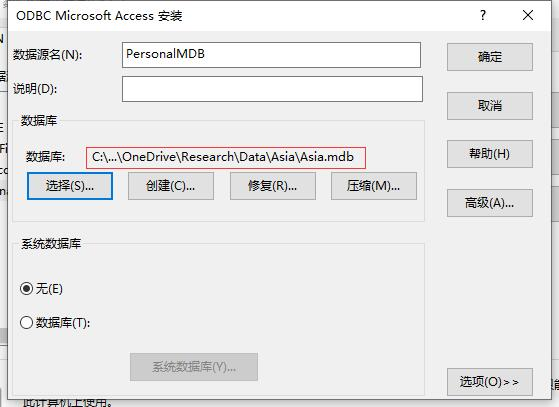
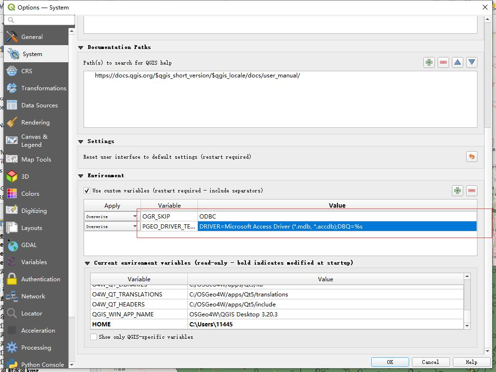
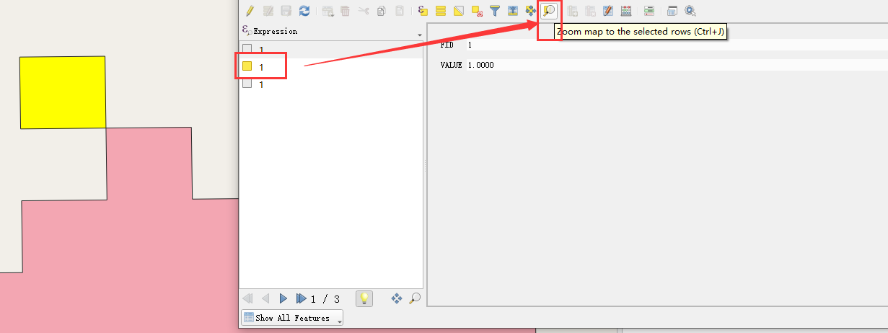
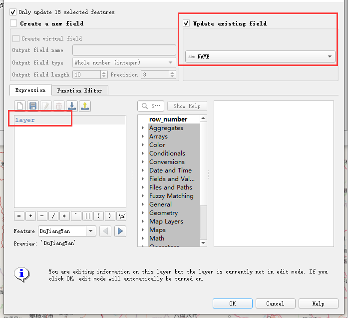
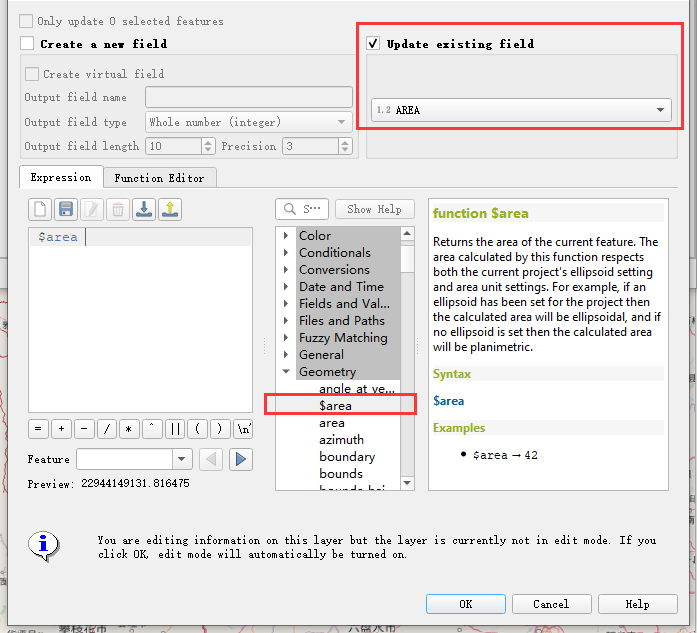
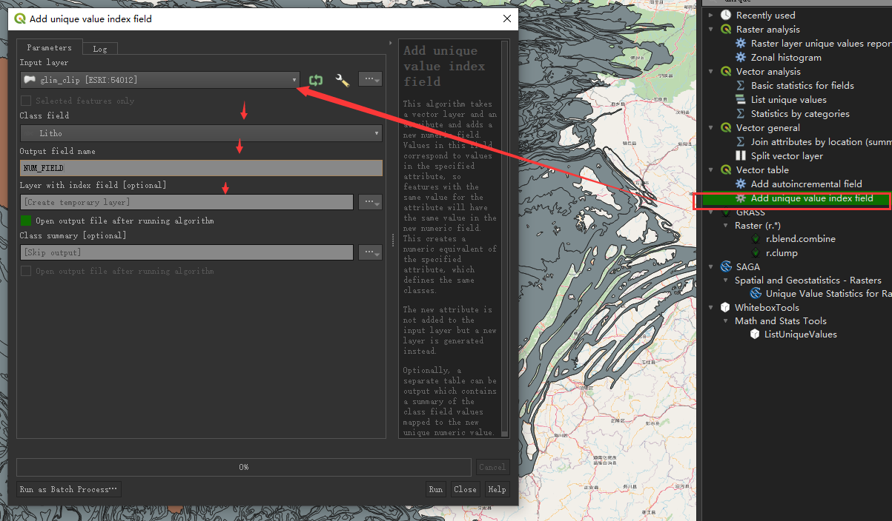
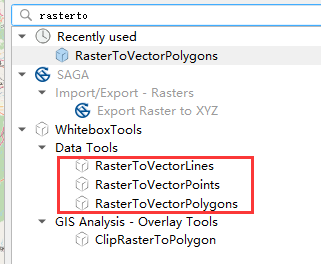

# 积累一些常用的QGIS操作

一些常用图形界面操作的简单积累记录，主要是processing toolbox中的处理工具的使用。参考资料：

- [24. QGIS processing framework](https://docs.qgis.org/3.22/en/docs/user_manual/processing/intro.html)

## 导入数据

一般的layer数据直接导入即可，比如常见的shp文件；

gdb文件一般是文件夹，直接通过 "Layer" -> "Add Layer" -> "Add Vector Layer"，然后选择 "Directory" 导入gdb文件夹即可，如果有问题可以看下[这里](https://gis.stackexchange.com/questions/26285/installing-file-geodatabase-gdb-support-in-qgis)；

MDB格式的文件相对特殊一点，这里简单记录下。主要参考：

- [How to Open Personal Geodatabase in QGIS](https://www.youtube.com/watch?v=RTtn0TA1fYM)
- [Opening Esri Personal Geodatabase (*.mdb) using QGIS?](https://gis.stackexchange.com/questions/129514/opening-esri-personal-geodatabase-mdb-using-qgis)

首先，下载一个示例数据，从[这里](https://www.cger.nies.go.jp/db/gdbd/gdbd_index_e.html)下载，选择“Asia”下载即可。

这是Esri的格式文件，必须在windows下打开，需要安装access数据库的引擎，我是安装的 office 365，所以已经自带了，就不再重复安装了，需要安装的请在[这里](http://www.microsoft.com/en-gb/download/details.aspx?id=13255)下载后安装。

在windows搜索栏搜索 ODBC，打开给出的 “ODBC 数据源（64位）”，点击“添加”，选择“Microsoft Access Driver ...”，然后起名字，我起了“PersonalMDB”，然后如下图所示“选择”好数据库对应到刚刚下载的mdb文件，然后点击“确定”。



接下来，打开QGIS，Settings -> Options | System | Environment，添加下面两个变量：

```Path
variable name: OGR_SKIP
value: ODBC

variable name: PGEO_DRIVER_TEMPLATE
value: DRIVER=Microsoft Access Driver (*.mdb, *.accdb);DBQ=%s
```

如下图所示：



然后最好重启下QGIS。

选择“Add Vector Layer …”->"Database"->"New"，然后配置如下，点击Test connection，应该会看到下图中的提示


然后点击“Add”键，会提示输入密码，因为我们没加密码，所以直接点击“OK”即可。这时候就会出现如下所示的对话框：


选择自己想要加入的项目即可。最后会得到如下所示的结果：


稍微介绍下，这个图，其中包括划分的流域及河网，可以看到流域是按照河流交汇点来划分的。

我们可以尝试把图层导出为shapefile，方便后续的处理，右键想要导出的图层，"Export"->"Save Feature As ..."：


## 矢量数据操作

### 多个多边形求并集多边形

即几个多边形融合为单独一个边界的多边形。可以先使用Processing Toolbox中的Vector overlay -> Union，然后再使用Vector geometry -> Dissolve ，如果多边形不能执行上面的操作，可以试一试先用Vector geometry -> Fix geometries 修正一下。

### 合并多个矢量图

参考[这里](https://grid.gaiaresources.com.au/user-manual/7-qgis-support/7-3-populating-shapefile-templates-in-qgis/7-03-4-merging-shapefiles-in-qgis/#:~:text=In%20QGIS%2C%20add%20the%20two%20shapefiles%20you%20wish,merging%3A%20Select%20the%20layers%20you%20wish%20to%20merge%3A)的介绍，直接使用Vector->Data Management Tools->Merge vectore layers

### Multipolygon转polygons

有时候自己制作的多边形可能有一些边角小polygon之类的，导致想生成的polygon变成了multipolygon，参考[这里](https://gis.stackexchange.com/questions/64214/saving-of-multi-polygon-shapefile-into-a-individual-polygon-shapefiles)，这时候可以使用Vector->Geometry Tools ->Multipart to singleparts 将一个multipolygon转成多个polygons，然后再查看下是哪些小polygon导致的:



如图操作，就能看到高亮的小边角了，可以直接把这些小边角去掉，不影响整体的。

### 批量操作

还以上面的 Multipolygon转polygons 为例，在Processing Toolbox中搜索 Multipart to singleparts，然后右键，选择：


在弹出框里增加要批量处理的图层即可。

### Field计算器

比较简单的，比如直接复制一列属性到另一列属性：

右键要修改属性的矢量图层，打开属性表，然后选择如下图所示：


然后如下图：



NAME这一列属性的值就等于layer这一列的值了。

再比如要计算面积：



根据这里的介绍，面积计算默认的单位是 square meters，所以如果想要转换单位在 area 后做单位转换计算即可。

### 字符串字段转为数字字段

可以直接使用如下：



填写如图中的选项，即可生成一个新的shapefile，它里面包含自己刚刚填的新字段名，会把老的字符串字段转换为数字字段，表示不同的类别。

### 切割矢量图

使用工具箱中的 "Vector overlay" -> "Extract/clip by extent"即可。

如果不成功，可以先fix一下矢量图，"Vector geometry" -> "Fix geometries"

### 矢量数据转栅格

比如要把shapefile转为geotiff文件。

直接使用工具栏里的 Rasterize (vector to raster) 工具即可：https://docs.qgis.org/2.8/en/docs/user_manual/processing_algs/gdalogr/gdal_conversion/rasterize.html

如下字段是一般要填的：


字段里面georeference units，我这个例子中是cm。所以100表示栅格分辨率是1m，可以自己试一试大的数，然后用测距工具测一测最小的网格长度就知道分辨率到底是多少了。

因为是转成栅格值，所以选择的输入字段值只能是数字格式，如果是字符串想转，可以先转成数字字段。

## 栅格数据操作

### 栅格数据转矢量

可以使用whitebox的 Data Tools：


