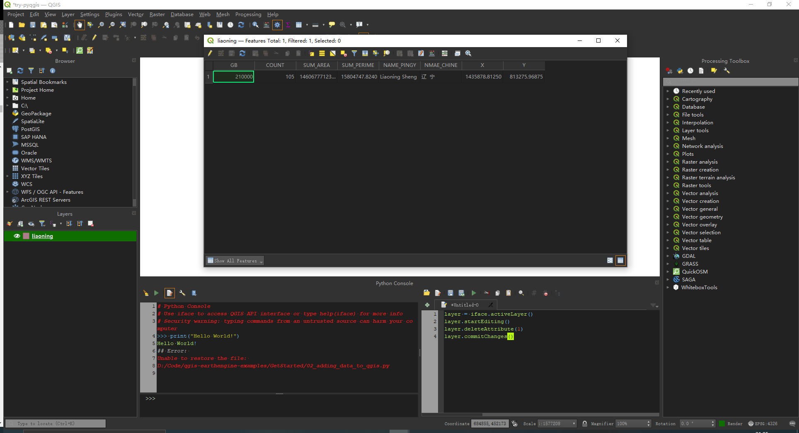

# 使用Python定制qgis

本文主要参考以下资料，了解QGIS 环境中 Python 编程，日常积累一些常用的QGIS操作的自动化，重点是QGIS Processing的编程使用，不过让我们先从python qgis的介绍开始。

- [Customizing QGIS with Python](https://courses.spatialthoughts.com/pyqgis-in-a-day.html)
- [Using processing algorithms from the console](https://docs.qgis.org/3.22/en/docs/user_manual/processing/console.html)

## PyQGIS 初识

QGIS 提供了 Python API（应用程序编程接口），一般称作 PyQGIS。 API 非常丰富且功能强大。可以使用 QGIS 进行的几乎所有操作都可以使用 API 完成。这允许开发人员编写代码来构建新工具、自定义界面和自动化工作流程。

现在尝试使用 API 来执行一些 GIS 数据管理任务，来初步见识下它。

qgis中浏览example数据目录并加载 liaoning shapefile 图层。打开属性表。该图层有 8 个属性列。假设我们要从图层中删除第2列。

在qgis GUI中操作就如下：

1. 右键单击liaoning图层，然后单击打开属性表。
2. 在属性表中，单击切换编辑模式按钮。
3. 单击删除字段按钮。选择 COUNT 列并单击确定。
4. 单击保存编辑按钮，然后单击切换编辑模式以停止编辑。

QGIS 提供了一个 API 来使用 Python 代码完成所有这些。现在使用 Python 代码执行此任务。打开编辑器并输入以下代码。单击“运行脚本”按钮以执行它。如下图所示：



在运行代码之前，请确保已在“图层”面板中选择了liaoning图层。

一步一步地理解代码：

1. layer = iface.activeLayer(): 这一行使用 iface 对象并运行 activeLayer() 方法，该方法返回 QGIS 中当前选择的图层。该方法返回对保存在 layer 变量中的层的引用。
2. layer.startEditing()：这相当于将图层置于编辑模式。
3. layer.deleteAttribute(1)：deleteAttribute() 是 QgsVectorLayer 类的一个方法。它需要要删除的属性的索引。在这里，我们为第二个属性传递索引 1。 （索引 0 是第一个属性）
4. layer.commitChanges()：此方法保存编辑缓冲区并禁用编辑模式。

## 了解 PyQGIS 类

了解与 C++ 和 Python 类相关的某些概念很重要。 Qt 和 QGIS 都是用 C++ 语言编写的。每个 Qt/QGIS Widget 的功能都作为一个具有某些属性和函数的类来实现。当我们使用 PyQt 或 PyQGIS 类时，它通过 python 绑定执行 C++ 类中的代码。

现在开始使用 PyQGIS 类。 QGIS 具有用于整个操作范围的类 - 从构建用户界面到进行地理处理。

接下来看看如何通过 PyQGIS API 访问这些类

### 一个例子：使用PyQGIS计算距离

GIS 中一个基本但重要的操作是距离和面积的计算。我们将看到如何使用 PyQGIS API 来计算距离。

我们将计算以下两个坐标之间的距离：

```Python
san_francisco = (37.7749, -122.4194)
new_york = (40.661, -73.944)
```

QGIS 提供了 QgsDistanceArea 类，该类具有计算距离和面积的方法。

要使用这个类，我们必须通过实例化它来创建一个对象。[类文档](https://qgis.org/pyqgis/master/core/QgsDistanceArea.html)里有说明该类构造函数不接受任何参数。我们可以使用默认构造函数创建一个对象并将其分配给 d 变量。

```Python
d = QgsDistanceArea()
```

文档提到，如果为 QgsDistanceArea 设置了有效的椭球，则所有计算都将使用椭球算法(由于我们要计算一对纬度/经度之间的距离，因此需要使用椭球算法)执行。所以设置椭球 WGS84，这个可以使用 setEllipsoid() 方法做到。请记住，方法应该应用于对象，而不是直接应用于类。

```Python
d.setEllipsoid('WGS84')
```

现在对象 d 能够执行椭球距离计算。浏览 QgsDistanceArea 类中的可用方法，可以看到一个 measureLine() 方法。这个方法需要一个列表 QgsPointXY 对象。可以从坐标对创建这些对象，并将它们传递给 measureLine() 方法来获取距离。

```Python
lat1, lon1 = san_francisco
lat2, lon2 = new_york
# Remember the order is X,Y
point1 = QgsPointXY(lon1, lat1)
point2 = QgsPointXY(lon2, lat2)

distance = d.measureLine([point1, point2])
print(distance/1000)
```

综上所述，下面是使用 PyQGIS 计算一对坐标之间距离的完整代码。当您在 QGIS 的 Python Console 中运行代码时，所有 PyQGIS 类都已经导入，不过如果从脚本或插件运行此代码，则必须显式导入 QgsDistanceArea 类。

```Python
from qgis.core import QgsDistanceArea

san_francisco = (37.7749, -122.4194)
new_york = (40.661, -73.944)

d = QgsDistanceArea()
d.setEllipsoid('WGS84')


lat1, lon1 = san_francisco
lat2, lon2 = new_york
# Remember the order is X,Y
point1 = QgsPointXY(lon1, lat1)
point2 = QgsPointXY(lon2, lat2)

distance = d.measureLine([point1, point2])
print(distance/1000)
```

### 另一个：GUI 编程

[Qt](https://www.qt.io/) 是一个免费的开源小部件工具包，用于创建图形用户界面以及跨平台应用程序。 QGIS 是使用 Qt 平台构建的。 Qt 和 QGIS 本身都有详细记录的 API，在编写要在 QGIS 中运行的 Python 代码时应该使用这些 API。

[PyQt](https://wiki.python.org/moin/PyQt) 是 Qt 的 Python 接口。 PyQt 提供了与 Qt 小部件交互的类和函数。

学习如何使用 PyQt 类来创建 GUI 元素并与之交互。在这里，我们将创建一个简单的对话框，提示用户进行确认。您可以在编辑器中键入代码并单击运行脚本。

```Python
mb = QMessageBox()
```

QMessageBox 是一个 PyQt 类，用于创建带有按钮的对话框。要使用该类，可以通过实例化该类来创建对象。这里 mb 是一个对象，它是 QMessageBox 类的一个实例，使用默认参数创建。

type(mb) 能告诉我们对象的类是什么。

类具有提供功能的方法。可以在实例对象上运行类方法。对于 QMessageBox 类， setText() 方法能向对话框添加文本。

## **QGIS Processing**

QGIS processing framework 是一个处理环境，它能用来调用QGIS自带或者第三方的算法。Processing是QGIS的核心插件，也就是 processing toolbox，即平常最常用的QGIS的工具箱。所以这部分才是python QGIS编程最常用的部分。

接下来看看如何在console中使用processing toolbox。

第一步，就是打开console，和前面介绍的是一致的，然后导入processing工具。

```Python
from qgis import processing
```

执行一个算法的最基本函数就是run()，其参数主要包括两部分，一是算法名，第二是一系列参数，字典格式，表明算法需要的参数。

所以第一我们要知道我们想要调用的算法名字是什么，这个名字和在toolbox中看到的名字是不完全一样的，而是一个单独的命令行名字，为了找到名字可以使用如下代码：

```Python
for alg in QgsApplication.processingRegistry().algorithms():
    print(alg.id(), "->", alg.displayName())
```

它会列出名字，在里面找到自己想要的名称即可。

接下来就要了解第二个参数怎么设置了。有一种方式能详细地列出算法细节：algorithmHelp(id_of_the_algorithm)。

例如：

```Python
processing.algorithmHelp("native:buffer")
```

就会列出buffer函数的细节。

然后我们就能运行函数了：processing.run(name_of_the_algorithm, parameters)

还是buffer函数：

```Python
processing.run("native:buffer", {'INPUT': '/data/lines.shp',
               'DISTANCE': 100.0,
               'SEGMENTS': 10,
               'DISSOLVE': True,
               'END_CAP_STYLE': 0,
               'JOIN_STYLE': 0,
               'MITER_LIMIT': 10,
               'OUTPUT': '/data/buffers.shp'})
```

接下来是一个小例子，看看如何从 DEM 创建山体阴影栅格。

先使用 QGIS processing toolbox 执行任务：

1. 浏览到数据目录并加载 srtm.tif 层；从处理工具箱中搜索并找到处理工具箱 → 栅格地形分析 → 山体阴影算法；双击打开它。
2. 选择 srtm 作为 Elevation 图层，并将所有其他参数保留为默认值。单击运行。
3. 一个新的山体阴影图层将添加到图层面板。现在我们将从处理历史中找到此操作的 Python 命令。转到**处理→历史*。
4. 顶部面板中的第一个条目将显示从工具箱中运行的最后一个算法。单击它以选择它。完整的 Python 命令将显示在底部。复制它。

您现在可以在 Python 代码中使用参数并替换输入路径。下面是从 Python 脚本运行相同算法的代码片段。请注意，我们正在使用 processing.runAndLoadResults() 方法将结果图层添加到画布。

```Python
import os
data_dir = os.path.join(os.path.expanduser('~'), 'Downloads', 'pyqgis_in_a_day')

filename = 'srtm.tif'
srtm = os.path.join(data_dir, filename)
iface.addRasterLayer(srtm, 'srtm', 'gdal')

results = processing.runAndLoadResults("native:hillshade", 
    {'INPUT': srtm, 
    'Z_FACTOR':2,
    'AZIMUTH':300,
    'V_ANGLE':40,
    'OUTPUT': 'TEMPORARY_OUTPUT'})
```

我们还可以链接多个处理工具来构建脚本来构建数据处理管道。在下面的示例中，我们将执行 2 个步骤

使用 shoreline.shp 图层剪辑 srtm.tif 栅格。
计算裁剪栅格上的山体阴影并将其加载到 QGIS 中。
请注意，我们在第一步使用 processing.run() 方法。此方法计算输出，但不会将结果加载到 QGIS。这允许我们执行多个处理步骤而不加载中间层。

```Python
import os
data_dir = os.path.join(os.path.expanduser('~'), 'Downloads', 'pyqgis_in_a_day')

filename = 'srtm.tif'
srtm = os.path.join(data_dir, filename)
filename = 'shoreline.shp'
shoreline = os.path.join(data_dir, filename) 

results = processing.run("gdal:cliprasterbymasklayer", 
    {'INPUT':srtm,
    'MASK': shoreline,
    'OUTPUT':'TEMPORARY_OUTPUT'})

clipped_dem = results['OUTPUT']
   
results = processing.runAndLoadResults("native:hillshade", 
    {'INPUT': clipped_dem, 
    'Z_FACTOR':2,
    'AZIMUTH':300,
    'V_ANGLE':40,
    'OUTPUT': 'TEMPORARY_OUTPUT'})
```

还可以通过迭代多个层并在 for 循环中运行处理算法来进行批处理。通过 Python 执行此操作可让您获得更大的灵活性 - 例如将结果合并到单个层中。有关完整示例，请参阅[通过 Python运行处理算法 教程](https://www.qgistutorials.com/en/docs/3/processing_algorithms_pyqgis.html)。
